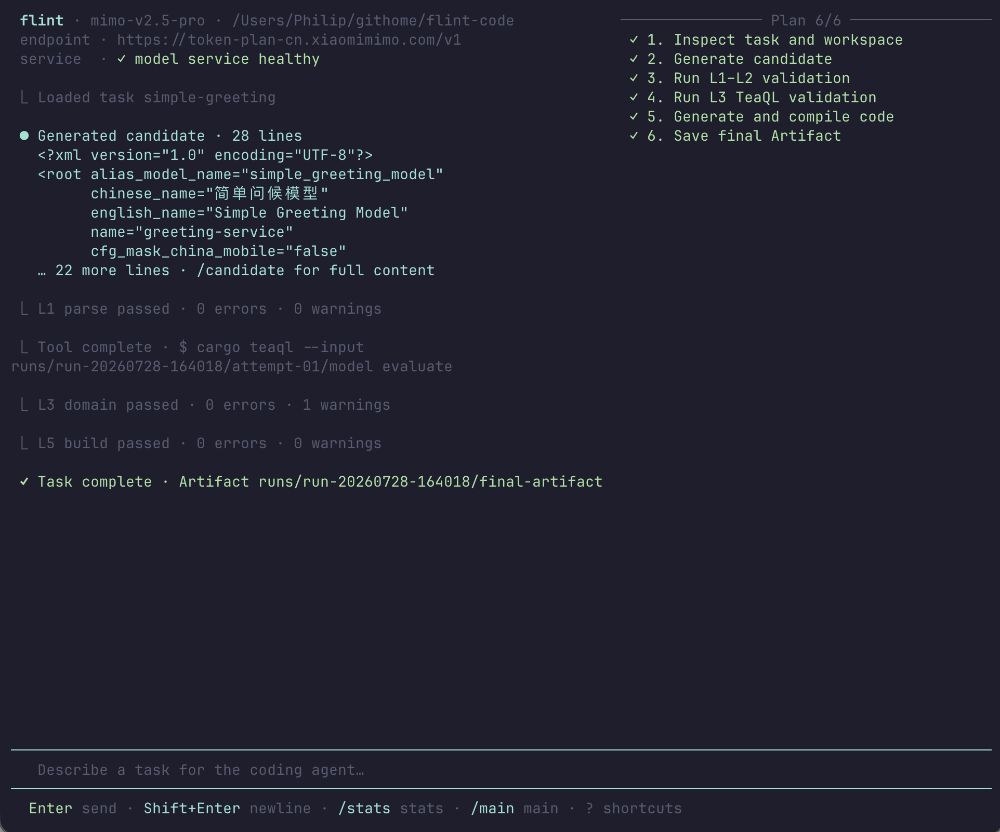

# KlintCode

> [!WARNING]
> **Active development:** KlintCode is under active development. APIs,
> configuration, workflows, and the TUI may change without notice. It is not
> yet recommended for production use.

> *Strike code without the cloud.* — 燧石取火，离线生码。

**KlintCode** is an AI coding agent designed for **air-gapped and compliance-restricted environments**. It runs entirely on local hardware (NVIDIA DGX Spark / DGX Station), requires no internet connection, and produces **compiler-verified** production code.

Built with Rust. Powered by [TeaQL](https://teaql.io).

## TUI Preview



## Why KlintCode?

Every major AI coding tool today — Cursor, Copilot, Devin, Windsurf — requires cloud connectivity. For organizations bound by regulatory, security, or data sovereignty constraints, **none of them are usable**.

KlintCode fills this gap:

| | Cloud Coding Agents | KlintCode |
|--|---------------------|-----------|
| **Network** | Requires internet | Air-gapped / offline |
| **Data privacy** | Code sent to cloud | Data never leaves premises |
| **Model size** | 100B+ parameters | Works with small local models |
| **Correctness** | Hope it compiles | **Compiler-verified** |
| **Compliance** | ❌ GDPR / HIPAA / 等保 | ✅ Fully compliant |

## How It Works

KlintCode doesn't try to be a general-purpose coding agent. Instead, it combines a **small local model** with a **deterministic validation pipeline** to guarantee correct output:

```
Business Requirements
       │
       ▼
┌──────────────────┐
│ LLM: Generate    │ ← Small model (Nemotron-3-Super, Llama, etc.)
│ KSML Domain Model│
└────────┬─────────┘
         │
    ┌────▼────┐
    │ L1-L2   │ Local XML validation
    │ L3      │ TeaQL domain validation (real semantics check)
    │ L4      │ cargo teaql rust-lib-core (generate runtime code)
    │ L5      │ cargo check (compiler verification ✓)
    │ L6      │ cargo teaql assist (extract real API signatures)
    │ L7      │ LLM: Generate business logic (guided by real APIs)
    │ L8      │ cargo check (final compilation ✓)
    └────┬────┘
         │
         ▼
  Verified, Compilable
  Production Rust Code
```

**The key insight**: We don't let the LLM guess APIs. TeaQL's `assist` system feeds the model **real, compiler-generated API signatures**. Combined with multi-level validation, even a small 8B model can produce code that **compiles on the first try**.

## Benchmark Results (NVIDIA DGX Spark)

30 business objects, full pipeline — from natural language to compilable Rust:

| Step | Duration | Description |
|------|----------|-------------|
| KSML Generation | ~315s | 10 LLM calls, ~5000 tokens |
| Domain Validation | ~1s | TeaQL semantic check |
| Code Generation | ~6s | `cargo teaql` for lib + app |
| Compilation | ~22s | Two `cargo check` passes |
| Assist Discovery | ~18s | 8 entity API signatures |
| Business Logic | ~30s | LLM writes query functions |
| **Total** | **~7 min** | **vs. 1-2 weeks manual** |

## Quick Start

### Prerequisites

- Local LLM inference endpoint (NIM, vLLM, Ollama, etc.)
- Rust 1.75+ with cargo
- `cargo-teaql` 2.0.8:
  ```bash
  cargo install cargo-teaql --version 2.0.8
  cargo-teaql install-links
  ```

### Build & Run

```bash
git clone https://github.com/teaql/klint-code.git
cd klint-code

# Build
cargo build --release

# Run evaluation suite
FLINTCODE_BASE_URL="http://localhost:8000" \
  ./target/release/klintcode evaluate \
    --plan benchmarks/rust-build-suite.toml \
    --output runs/

# Interactive TUI
./target/release/klintcode-tui
```

The TUI opens with its prompt composer focused. Type a task and press `Enter`
to submit it through the normal Pipeline. Use `Shift+Enter` or `Alt+Enter` for
a new line. The composer grows from one to eight visible lines; additional
lines remain editable while the viewport follows the latest eight. Use `Esc`
for dashboard shortcuts and `i` to return to the composer.
The default surface stays minimal; enter `/stats` for Plan, Validation,
Context, and Token details, then `/main` to return.

### Dynamic Plan and Tool Probe

Use the persistent protocol probe to test whether an OpenAI-compatible model
can generate a task-specific plan, publish explicit plan status transitions,
call constrained tools, edit an isolated Rust fixture, and pass its tests:

```bash
MIMO_API_KEY="<key>" \
FLINTCODE_ENDPOINT="https://example.com/v1" \
FLINTCODE_MODEL="model-id" \
node scripts/model-agent-probe.mjs
```

The probe never edits the repository. It writes a detailed `report.json` to
its temporary workspace.

### Bounded Skill Composition Probe

Test whether MiMo can turn one immutable task goal and a bounded candidate
skill set into a dependency-safe execution plan:

```bash
MIMO_API_KEY="<key>" \
FLINTCODE_MODEL="mimo-v2.5-pro" \
node scripts/mimo-skill-planner-probe.mjs \
  --output /tmp/mimo-skill-plan-report.json
```

The probe includes phase-incompatible and unauthorized distractor skills. It
checks goal preservation, skill identity, phase and permission constraints,
input/output bindings, DAG validity, and acceptance-criterion coverage. Use
`--dry-run` to inspect the static test payload without contacting a model.

Add `--with-tools` to run the hierarchical DAG test. After the model creates
the Skill TaskGraph, a second bounded request expands every selected Skill into
a Tool ExecutionGraph. The local validator checks Skill-to-Tool allowlists,
permissions, bindings, exports, traceability, cycles, and the merged topological
execution waves:

```bash
MIMO_API_KEY="<key>" \
node scripts/mimo-skill-planner-probe.mjs \
  --with-tools \
  --output /tmp/mimo-hierarchical-dag-report.json
```

### Configuration

Profiles are stored in `profiles/`. Example:

```toml
[model]
name = "nemotron-3-super"
endpoint = "http://localhost:8000/v1"
max_context = 65536
temperature = 0.1
```

## Project Structure

```
klintcode/
├── apps/
│   ├── klintcode-cli/        # Headless CLI for batch evaluation
│   └── klintcode-tui/        # Interactive TUI (ratatui)
├── crates/
│   ├── agent-core/           # State machine, reducer, event loop
│   ├── pipeline/             # Evaluation suite runner, build validation
│   ├── model-vllm/           # LLM client (OpenAI-compatible)
│   ├── validation/           # Multi-level validation engine
│   ├── context-builder/      # Prompt construction, token budgeting
│   ├── artifact-store/       # Run output and artifact management
│   ├── tool-runner/          # External tool execution
│   └── workspace-guard/      # Workspace isolation
├── benchmarks/
│   ├── tasks/                # Test cases (school-service, moving-company, etc.)
│   ├── rust-build-suite.toml # Quick validation suite
│   └── rust-full-30obj-bench.toml  # Full 30-object benchmark
└── profiles/                 # Model/hardware configuration
```

## Validation Pipeline

KlintCode's multi-level validation is what makes small models reliable:

| Level | What | How |
|-------|------|-----|
| **L1** | XML well-formedness | Local parser |
| **L2** | Schema conformance | Structure check |
| **L3** | Domain semantics | `cargo teaql evaluate` (real TeaQL rules) |
| **L4** | Code generation | `cargo teaql rust-lib-core` |
| **L5** | Compilation | `cargo check` (Rust compiler) |
| **L6** | API discovery | `cargo teaql assist` (real API signatures) |
| **L7** | Business logic | LLM + assist output → query functions |
| **L8** | Full compilation | `cargo check` on complete workspace |

If any level fails, the pipeline triggers an automatic **repair loop** — the LLM receives the specific error and regenerates.

## Target Hardware

KlintCode is hardware-agnostic but optimized for local inference:

| Device | Model Size | Speed | Context |
|--------|-----------|-------|---------|
| **DGX Spark** | ≤ 70B (quantized) | ~16 tok/s | 64K |
| **DGX Station** | ≤ 1T | ~150+ tok/s | 128K+ |
| **Any GPU server** | Varies | Varies | Varies |

## TeaQL Integration

KlintCode follows the [TeaQL Agent Kit](https://github.com/teaql/teaql-agent-kit) rules:

- Never guess method names — use `assist` output
- Never edit generated files in `rust-lib-core/`
- Every query: `.purpose("why")` and `.comment("what")`
- Every save: `.audit_as("description")`
- Required: `cargo-teaql` 2.0.8

## License

Licensed under either of

- [MIT License](LICENSE-MIT)
- [Apache License, Version 2.0](LICENSE-APACHE)

at your option.

## Related

- [TeaQL](https://teaql.io) — Deterministic execution for non-deterministic AI
- [teaql-agent-kit](https://github.com/teaql/teaql-agent-kit) — Evaluation framework for AI coding agents
- [ratatui](https://ratatui.rs) — Rust terminal UI framework
